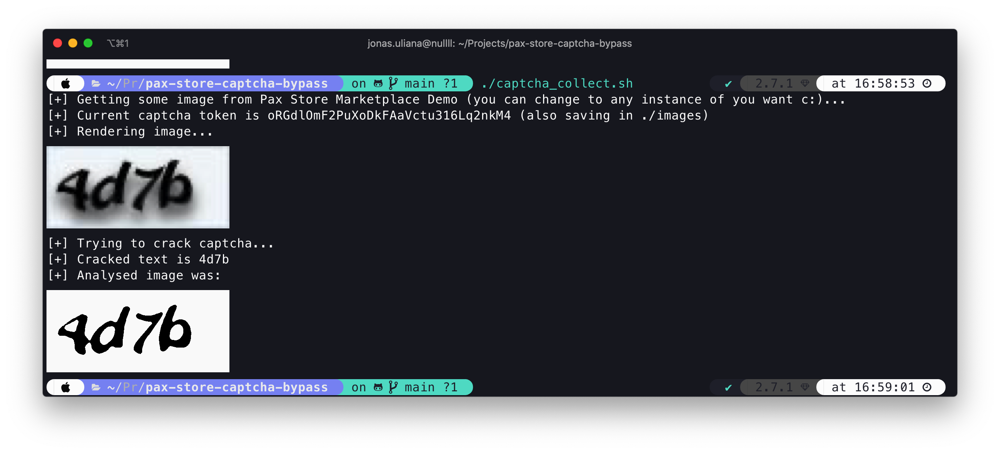

# PAX Store captcha *bypass* with OCR

This project aims to example how basics captchas can be dangerous for your application. Also, this is not an exploit or any kind of code that can affect PAX or any customers of PAX Store platform.

## Dependencies

For properly run this *script* you need:

- `tesseract` on version `4.1.1` (default language pack);
- `imgcat` on version `2.3.2` (optional, you need to comment on the references for the binary on `captcha_collect.sh`);

## License

This project is licensed under [The Unlicense](https://github.com/BizarreNULL/pax-store-captcha-bypass/blob/main/LICENSE).